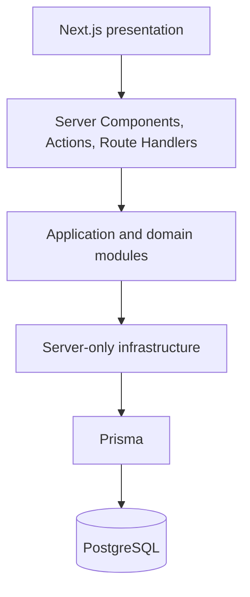

# Architecture

## Current decision

PredictiveMaintenance starts as a server-first modular monolith in one Next.js application. It has one deployable unit and, when data persistence begins, one PostgreSQL database accessed through Prisma.

The Python workspace under `ml/` is not a deployable unit. It is a local workspace for data preparation and modeling, and deploying any part of it is a change to this boundary.

This is a boundary for the MVP, not a complete domain design. No domain module or table exists until real data and product decisions justify it.



## Responsibilities

- `src/app`: routes, layouts, HTTP boundaries, and presentation. It coordinates use cases but does not contain business rules or direct Prisma calls.
- `src/modules`: cohesive vertical domain slices created only when a real use case exists.
- `src/lib`: shared technical configuration and infrastructure such as environment validation and the Prisma client.
- `prisma`: the persistence schema and migrations once the domain is known.
- `src/generated`: generated Prisma Client code; never edited or committed.
- `ml`: the Python workspace for data preparation and modeling. Nothing in `src/` imports it and the deployment does not run it; see the ML workspace section below.

A module may use shared infrastructure. Infrastructure must not decide business policy, and presentation must not bypass modules to reach Prisma.

## Request flows

### Server-rendered read

```text
Browser -> Server Component -> module use case -> server-only repository/Prisma -> PostgreSQL
```

The Server Component receives a view-ready result. It must not leak database records or credentials into client bundles.

### Internal UI mutation

```text
Form -> Server Action -> Zod validation -> module use case -> infrastructure -> response/revalidation
```

Use a Server Action when the mutation belongs to this UI and does not need an independent HTTP contract.

### HTTP integration

```text
HTTP client -> Route Handler -> Zod validation -> module use case -> infrastructure -> controlled HTTP response
```

Use a Route Handler for public or integration-facing HTTP contracts. The current `/api/health` handler is intentionally independent of PostgreSQL.

## Server and Client Components

Server Components are the default for data access, composition, and non-interactive rendering. Add `"use client"` only when a component needs browser APIs, local interactive state, effects, or event handlers. Keep the client boundary as small as practical and pass serializable data into it.

## Frontend prototype

The current dashboard uses one typed, static maintenance snapshot while backend contracts are still pending. The root route renders two purpose-built presentations from that same data: a server-rendered command center for large plant monitors and a mobile PWA view for alert-focused remote follow-up. CSS selects the presentation by viewport; no user-agent detection or duplicated business rules are needed.

Both presentations link to the statically generated `/machines/[machineId]` detail route. That Server Component validates the route parameter with Zod and derives its signals, alerts, and activity from the same snapshot, so the investigation flow stays consistent without adding a backend contract.

Only the mobile shell is a Client Component because it owns tab, filter, and notification-read state. PWA support currently covers install metadata, local icons, and the simulated notification center. Service workers, push subscriptions, realtime transport, and persistence stay out of scope until their product and backend requirements are validated.

## Prisma

`src/lib/db/prisma.ts` is server-only and creates a cached client lazily. This prevents hot reload from creating repeated pools while allowing the application to build and start without `DATABASE_URL`. A missing URL fails only when database access is requested.

The schema intentionally has no business models. Dataset structure alone is not automatically the product domain; both data and use cases must be understood before adding tables.

## ML workspace (Python)

`ml/` is an isolated Python workspace. Data preparation and model training happen in Python, and keeping them out of the TypeScript application leaves the application's dependency and release boundary unchanged.

What it holds today:

- `ml/datos`: data artifacts tracked with Git LFS (the cleaned dataset). The canonical CSV stays in `datos/`.
- `ml/notebooks`: dataset generation, exploratory cleaning and modeling, in numbered phases.
- `ml/api`: a FastAPI prototype that loads a trained LightGBM model and exposes `/api/v1/predict/falla`.

What is deliberately not decided yet:

- **The prototype is not deployed.** It has no Dockerfile, it is not in `compose.yaml`, no workflow builds or tests it, and the production environment does not run it.
- **No contract exists between the application and the model.** The dashboard still renders one typed static snapshot, so no request path reaches a prediction today.
- **How a prediction reaches the product is open**: batch scoring into PostgreSQL, a deployed second service, or something else. The question is registered in `OPEN-QUESTIONS.md`, and extracting a service requires an ADR, per the rule below.

The notebooks read the canonical dataset from its published URL or from `datos/`; they must not keep a second copy under `ml/` (see `DEVELOPMENT.md`).

## Batch work

If dataset import, feature calculation, or scoring later requires scheduled work, start with a repeatable command in this repository and run it as a separate platform job. Add a queue, worker service, or scheduler only when measured duration, concurrency, retries, or isolation make the simple job insufficient.

## Architectural limits

- One deployment means modules share release cadence and process resources.
- PostgreSQL is the only selected datastore; its production topology is undecided.
- Authentication, authorization, realtime transport and notifications are not designed.
- The prediction prototype under `ml/api` is not integrated: the boundary between the application and the model, its deployment and its model versioning are not designed.
- Large ingestion or compute workloads may eventually require a separate process, but there is no evidence for that split yet.

Extract a service only when an observed scaling, reliability, security, technology, or ownership boundary outweighs the operational cost. Record that change in an ADR.
