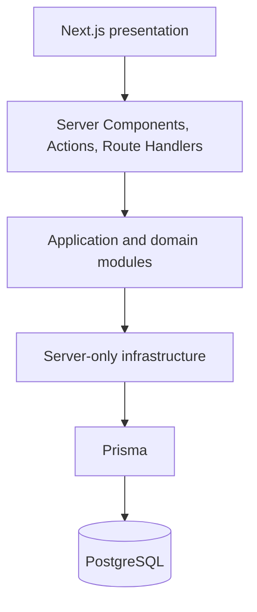

# Architecture

## Current decision

PredictiveMaintenance starts as a server-first modular monolith in one Next.js application. It has one deployable unit and, when data persistence begins, one PostgreSQL database accessed through Prisma.

This is a boundary for the MVP, not a complete domain design. No domain module or table exists until real data and product decisions justify it.



## Responsibilities

- `src/app`: routes, layouts, HTTP boundaries, and presentation. It coordinates use cases but does not contain business rules or direct Prisma calls.
- `src/modules`: cohesive vertical domain slices created only when a real use case exists.
- `src/lib`: shared technical configuration and infrastructure such as environment validation and the Prisma client.
- `prisma`: the persistence schema and migrations once the domain is known.
- `src/generated`: generated Prisma Client code; never edited or committed.

A module may use shared infrastructure. Infrastructure must not decide business policy, and presentation must not bypass modules to reach Prisma.

## Request flows

### Server-rendered read

```text
Browser -> Server Component -> module use case -> server-only repository/Prisma -> PostgreSQL
```

The Server Component receives a view-ready result. It must not leak database records or credentials into client bundles.

### Internal UI mutation

```text
Form -> Server Action -> Zod validation -> module use case -> infrastructure -> response/revalidation
```

Use a Server Action when the mutation belongs to this UI and does not need an independent HTTP contract.

### HTTP integration

```text
HTTP client -> Route Handler -> Zod validation -> module use case -> infrastructure -> controlled HTTP response
```

Use a Route Handler for public or integration-facing HTTP contracts. The current `/api/health` handler is intentionally independent of PostgreSQL.

## Server and Client Components

Server Components are the default for data access, composition, and non-interactive rendering. Add `"use client"` only when a component needs browser APIs, local interactive state, effects, or event handlers. Keep the client boundary as small as practical and pass serializable data into it.

## Prisma

`src/lib/db/prisma.ts` is server-only and creates a cached client lazily. This prevents hot reload from creating repeated pools while allowing the application to build and start without `DATABASE_URL`. A missing URL fails only when database access is requested.

The schema intentionally has no business models. Dataset structure alone is not automatically the product domain; both data and use cases must be understood before adding tables.

## Batch work

If dataset import, feature calculation, or scoring later requires scheduled work, start with a repeatable command in this repository and run it as a separate platform job. Add a queue, worker service, or scheduler only when measured duration, concurrency, retries, or isolation make the simple job insufficient.

## Architectural limits

- One deployment means modules share release cadence and process resources.
- PostgreSQL is the only selected datastore; its production topology is undecided.
- Authentication, authorization, realtime transport, notifications, predictive services, and MLOps are not designed.
- Large ingestion or compute workloads may eventually require a separate process, but there is no evidence for that split yet.

Extract a service only when an observed scaling, reliability, security, technology, or ownership boundary outweighs the operational cost. Record that change in an ADR.
