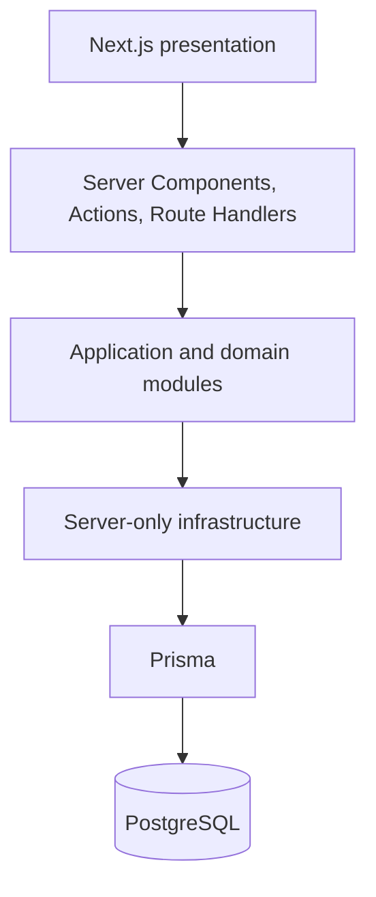

# Architecture

## Current decision

PredictiveMaintenance starts as a server-first modular monolith in one Next.js application. It has one deployable unit and one PostgreSQL database accessed through Prisma for identity, administration, audit, machine presentation, and the MVP maintenance schema in [ADR 0008](./adr/0008-mvp-machine-hour-persistence.md). Application modules do not read those maintenance tables yet, and the migration has not been created.

The Python workspace under `ml/` is not a deployable unit. It is a local workspace for data preparation and modeling, and deploying any part of it is a change to this boundary.

This is a boundary for the MVP, not a complete domain design. Identity and administration are explicitly approved in [ADR 0007](./adr/0007-identity-administration.md). The machine-hour persistence model is in [ADR 0008](./adr/0008-mvp-machine-hour-persistence.md). How a prediction reaches the product, and the open product questions in `OPEN-QUESTIONS.md`, are still undecided.


```mermaid
flowchart TD
    UI[Next.js presentation] --> BOUNDARY[Server Components, Actions, Route Handlers]
    BOUNDARY --> MODULES[Application and domain modules]
    MODULES --> INFRA[Server-only infrastructure]
    INFRA --> PRISMA[Prisma]
    PRISMA --> PG[(PostgreSQL)]
```

## Responsibilities

- `src/app`: routes, layouts, HTTP boundaries, and presentation. It coordinates use cases but does not contain business rules or direct Prisma calls.
- `src/modules`: cohesive vertical domain slices created only when a real use case exists.
- `src/lib`: shared technical configuration and infrastructure such as environment validation and the Prisma client.
- `prisma`: the persistence schema and migrations for approved use cases.
- `src/generated`: generated Prisma Client code; never edited or committed.
- `ml`: the Python workspace for data preparation and modeling. Nothing in `src/` imports it and the deployment does not run it; see the ML workspace section below.

A module may use shared infrastructure. Infrastructure must not decide business policy, and presentation must not bypass modules to reach Prisma.

## Request flows

### Server-rendered read

```text
Browser -> Server Component -> module use case -> server-only repository/Prisma -> PostgreSQL
```

The Server Component receives a view-ready result. It must not leak database records or credentials into client bundles.

### Internal UI mutation

```text
Form -> Server Action -> Zod validation -> module use case -> infrastructure -> response/revalidation
```

Use a Server Action when the mutation belongs to this UI and does not need an independent HTTP contract.

### HTTP integration

```text
HTTP client -> Route Handler -> Zod validation -> module use case -> infrastructure -> controlled HTTP response
```

Use a Route Handler for public or integration-facing HTTP contracts. The current `/api/health` handler is intentionally independent of PostgreSQL.

## Server and Client Components

Server Components are the default for data access, composition, and non-interactive rendering. Add `"use client"` only when a component needs browser APIs, local interactive state, effects, or event handlers. Keep the client boundary as small as practical and pass serializable data into it.

## Frontend prototype

The current dashboard uses one typed, static maintenance snapshot while backend contracts are still pending. The root route renders two purpose-built presentations from that same data: a server-rendered command center for large plant monitors and a mobile PWA view for alert-focused remote follow-up. CSS selects the presentation by viewport; no user-agent detection or duplicated business rules are needed.

Both presentations link to `/machines/[machineId]`. That Server Component validates the route parameter with Zod and derives its signals, alerts, and activity from the same snapshot. Protected reads also resolve the current user's permissions and may overlay persisted presentation, so they require request-time authorization rather than a shared static result.

The desktop layout groups plant counts in one status strip, gives the first priority equipment its signals, and uses a table for inventory comparison. Mobile keeps compact lists and the same status vocabulary. Both default to light neutral surfaces and offer the previous dark blue palette through the user's persisted profile preference. Shared semantic CSS tokens cover surfaces, text, borders, actions, and statuses; the server renders `data-theme` and matching viewport metadata from the authenticated account. Sensor charts use relative scales per sensor, break lines at missing readings, and expose values through accessible descriptions; they do not imply timestamps or comparable magnitudes across different sensors.

The mobile shell owns tab, filter, and notification-read state in a Client Component. Interactive administration forms and image fallbacks also use small client boundaries. PWA support currently covers install metadata, local icons, and the simulated notification center. Service workers, push subscriptions, realtime transport, and maintenance-data persistence stay out of scope until their product and backend requirements are validated.

## Identidad y administración

La arquitectura de [ADR 0007](./adr/0007-identity-administration.md) incorpora tres módulos: `identity` para credenciales, sesiones opacas, permisos, referencias y auditoría; `admin` para el backoffice; y `machine-presentation` para personalización y galería. Sus casos de uso acceden a Prisma desde el servidor. Las páginas protegidas requieren sesión y filtran registros por permiso, ámbito y vigencia; las mutaciones vuelven a comprobar la autoridad vigente.

`AccessResource` mantiene un árbol explícito de referencias de autorización separado del modelo industrial. El seed sólo registra los equipos del mock, sin inventar organizaciones, plantas o áreas. Un administrador con `settings.update` global puede cargar la jerarquía real. `MachinePresentation` usa esas referencias para superponer nombre, descripción e imágenes sin cambiar señales, alertas ni predicciones.

El envío SMTP y el almacenamiento S3/R2 son adaptadores opcionales. Sin transporte de correo, una invitación puede entregarse mediante un enlace copiable por un administrador autorizado; sin almacenamiento configurado se conservan las URLs externas de imágenes admitidas. El alcance, la matriz de requisitos y la validación pendiente se mantienen en [AUTH-ADMIN.md](./AUTH-ADMIN.md).

## Prisma

`src/lib/db/prisma.ts` is server-only and creates a cached client lazily. This prevents hot reload from creating repeated pools while allowing the application to build and start without `DATABASE_URL`. A missing URL fails only when database access is requested.

The schema contains identity, access, audit, presentation, and the MVP maintenance models (`Activo`, `LecturaMaquinaHora`, `PrediccionIA`, `EventoFalla`, `Alerta`, `RevisionAlerta`, `OrdenTrabajo`). Dataset targets and derived ML features are not columns. See [ADR 0008](./adr/0008-mvp-machine-hour-persistence.md) and [`DATA-MODEL.md`](./DATA-MODEL.md). Protected pages now need a configured database and bootstrap data even though lazy client initialization still allows database-independent paths such as `/api/health`. The maintenance migration is not created yet, so a database migrated only with the existing identity migrations does not have those tables.

## ML workspace (Python)

`ml/` is an isolated Python workspace. Data preparation and model training happen in Python, and keeping them out of the TypeScript application leaves the application's dependency and release boundary unchanged.

What it holds today:

- `ml/datos`: data artifacts tracked with Git LFS (the cleaned dataset). The canonical CSV stays in `datos/`.
- `ml/notebooks`: dataset generation, exploratory cleaning and modeling, in numbered phases.
- `ml/api`: a FastAPI prototype that loads a trained LightGBM model and exposes `/api/v1/predict/falla`.

What is deliberately not decided yet:

- **The prototype is not deployed.** It has no Dockerfile, it is not in `compose.yaml`, no workflow builds or tests it, and the production environment does not run it.
- **No contract exists between the application and the model.** The dashboard still renders one typed static snapshot, so no request path reaches a prediction today.
- **How a prediction reaches the product is open**: batch scoring into PostgreSQL, a deployed second service, or something else. The question is registered in `OPEN-QUESTIONS.md`, and extracting a service requires an ADR, per the rule below.

The notebooks read the canonical dataset from its published URL or from `datos/`; they must not keep a second copy under `ml/` (see `DEVELOPMENT.md`).

## Batch work

If dataset import, feature calculation, or scoring later requires scheduled work, start with a repeatable command in this repository and run it as a separate platform job. Add a queue, worker service, or scheduler only when measured duration, concurrency, retries, or isolation make the simple job insufficient.

## Architectural limits

- One deployment means modules share release cadence and process resources.
- PostgreSQL is the only selected datastore; its production topology is undecided.
- Identity and authorization are defined in ADR 0007; their end-to-end verification and external SMTP/storage setup remain tracked in AUTH-ADMIN.md. Realtime transport and operational notifications are not designed.
- The prediction prototype under `ml/api` is not integrated: the boundary between the application and the model, its deployment and its model versioning are not designed.
- Large ingestion or compute workloads may eventually require a separate process, but there is no evidence for that split yet.

Extract a service only when an observed scaling, reliability, security, technology, or ownership boundary outweighs the operational cost. Record that change in an ADR.
